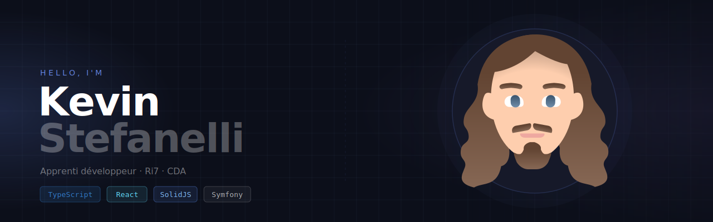

  
  
  
  

---

Passionné par la programmation, j'aime concevoir des applications modernes, performantes et faciles à utiliser.
Actuellement en alternance chez **Ri7**, pour préparer le diplôme de **Concepteur et Développeur d'Application**.

## Stack

### Langages

  
  
  
  
  

### Frontend

  
  
  
  
  
  

### Backend

  
  
  

### Runtime & outils

  
  
  
  

## AI & Agents

Passionné par l'IA appliquée au développement, je conçois des **workflows d'agents autonomes** capables d'orchestrer des tâches complexes : agrégation de données, génération de contenu, automatisation et pipelines multi-étapes.

  
  
  
  
  

